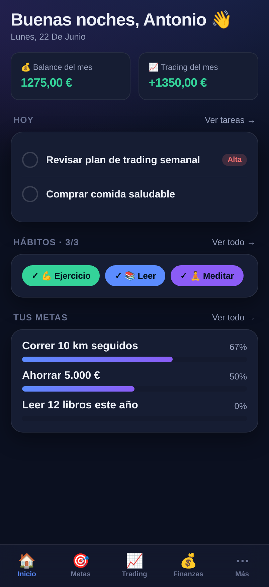
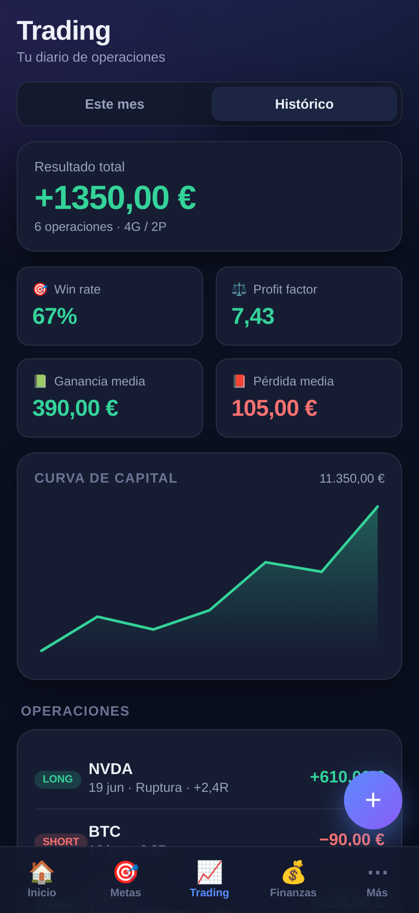
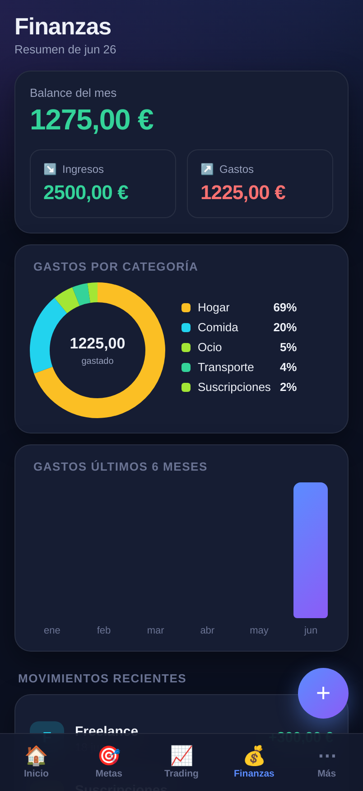
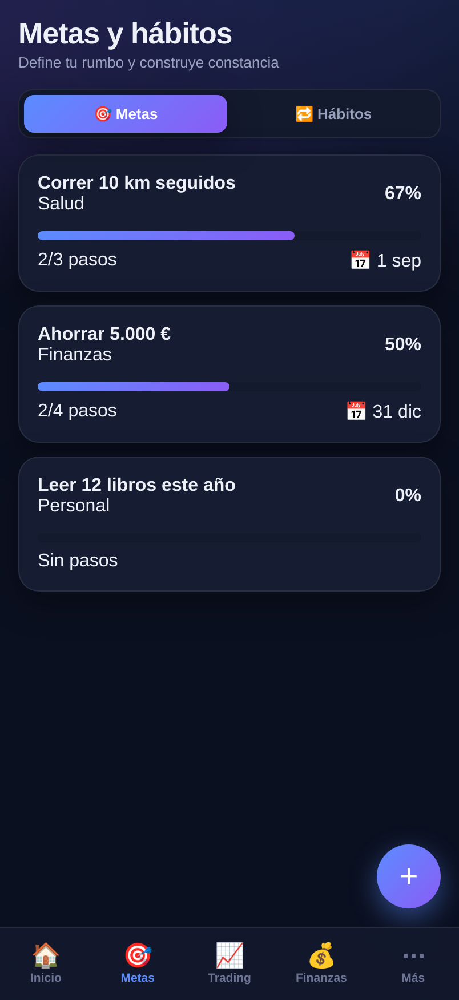
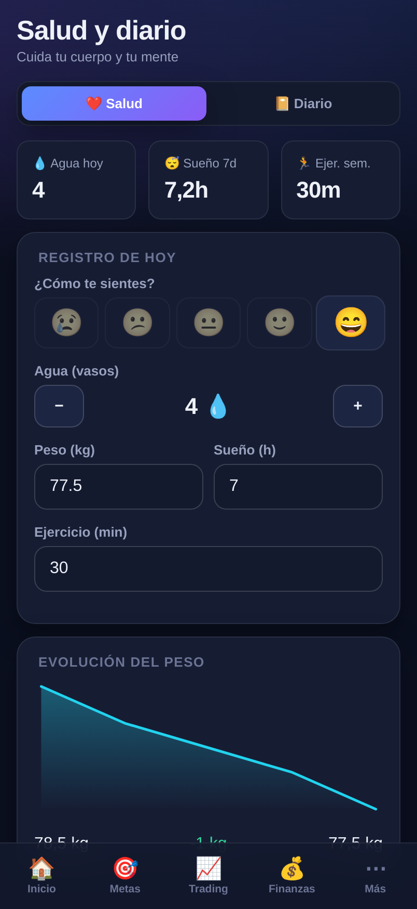

# 🚀 Mi Vida

**Tu app personal para tener todos los aspectos de tu vida bajo control y avanzar hacia tus metas.**

Mi Vida es una aplicación móvil (PWA) que reúne en un solo sitio tus **metas**, **hábitos**,
**tareas**, **finanzas**, **trading** y **bienestar**. Funciona en el navegador del móvil,
se puede **instalar en la pantalla de inicio** como una app nativa, funciona **sin conexión**
y guarda tus datos **solo en tu dispositivo** (privacidad total).

<p align="center">
  
  
  
</p>
<p align="center">
  
  
</p>

---

## ✨ Qué incluye

- **🏠 Inicio** — Centro de control con un resumen del día: tareas pendientes, hábitos de hoy,
  progreso de tus metas y un vistazo a tus finanzas y trading del mes.
- **🎯 Metas y hábitos**
  - Metas con descripción, categoría, fecha objetivo y **pasos (hitos)** para dividirlas; barra de progreso automática.
  - Hábitos diarios o semanales con **racha 🔥**, registro de los últimos 7 días y seguimiento semanal.
- **📝 Tareas y agenda** — Lista de pendientes con prioridad, fecha y categoría. Vistas: Hoy, Próximas, Todas y Hechas.
- **💰 Finanzas** — Ingresos y gastos por categoría, balance mensual, **gráfico de gastos por categoría**
  y evolución de los últimos 6 meses.
- **📈 Trading** — Diario de operaciones con resultado (P&L), **win rate**, **profit factor**,
  ganancia/pérdida media y **curva de capital**. Filtra por mes o histórico.
- **❤️ Salud y diario** — Registro diario de ánimo, agua, peso, sueño y ejercicio, con
  **tendencia del peso**; y un **diario personal** para tus reflexiones.
- **⚙️ Ajustes** — Perfil (nombre, moneda, capital inicial), tema claro/oscuro y
  **copia de seguridad** (exportar/importar todos tus datos en un archivo).

> Tus datos nunca salen de tu dispositivo. Exporta una copia de vez en cuando desde *Ajustes*
> para no perderlos y poder pasarlos a otro móvil.

---

## 📱 Cómo instalarla en tu móvil

Una vez publicada (ver más abajo), abre la web en tu teléfono:

- **iPhone (Safari):** botón *Compartir* → **«Añadir a pantalla de inicio»**.
- **Android (Chrome):** menú **⋮** → **«Instalar app»**.

Se abrirá a pantalla completa y funcionará sin conexión, como cualquier app.

---

## 🛠️ Desarrollo

Requisitos: [Node.js](https://nodejs.org) 18 o superior.

```bash
npm install        # instalar dependencias
npm run dev        # arrancar en modo desarrollo (http://localhost:5173)
npm run build      # compilar para producción (carpeta dist/)
npm run preview    # previsualizar la build de producción
npm run icons      # regenerar los iconos de la app
```

### Tecnología

- **React + TypeScript + Vite**
- **PWA** (instalable y offline) con `vite-plugin-pwa`
- **React Router** (navegación con pestañas inferiores)
- Almacenamiento local (`localStorage`) — sin servidor ni cuentas
- Gráficos en **SVG hechos a medida** (sin librerías pesadas)

---

## 🌐 Publicar (GitHub Pages)

El repositorio incluye un flujo de trabajo que compila y despliega la app automáticamente.

1. Fusiona estos cambios en la rama **`main`**.
2. En GitHub: **Settings → Pages → Build and deployment → Source = GitHub Actions**.
3. Cada push a `main` publicará la app en `https://antoniocaravantess.github.io/`.

También puedes lanzarlo manualmente desde la pestaña **Actions → Desplegar en GitHub Pages → Run workflow**.

---

Hecho con cariño para ayudarte a lograr tus metas. 💪
